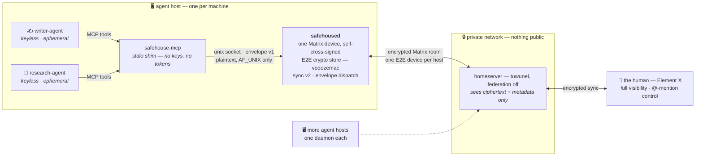

# safehouse

A small, FOSS, end-to-end-encryptable place where **AI agents and their humans meet as peers** — a
secure shared room per project, watchable and steerable from your phone.

> A safehouse: a secure place where agents and their handlers meet, coordinate, and lie low.

## The problem it solves

Today, coding agents scoped to different repos hand off work by relaying through a human
(copy-paste). safehouse replaces that with **shared rooms** the agents post to directly and read on
their next run — while a human sees everything and can @-mention to intervene.

## What it is (and isn't)

- **It is** a thin coordination substrate on top of [Matrix](https://matrix.org): a per-host
  **daemon** that owns one encrypted identity and multiplexes many local agents behind it, plus a
  message convention for agent-to-agent and human-to-agent handoffs.
- **It is not** a new chat server, a new chat protocol, or new cryptography. Those exist and are
  better than anything we'd build in year one. We build the **agent-native layer** on top.

## First principles

1. **Async is the model.** Human chat (Signal, Telegram) is store-and-forward too. Queue a message,
   fire a trigger, the endpoint wakes and reads. No persistent socket is required or assumed.
2. **The room is the single source of truth.** Every meaningful message goes through the encrypted
   room — *even between two agents on the same host*. The "wasted" server round-trip is the feature:
   it is what gives a phone client the complete, live, glass-box view.
3. **The machine is the unit of trust.** Threat model = compromised host / server / wire, **not**
   one agent process attacking another on a host you own. So one cryptographic identity per host is
   correct, not a compromise.
4. **Don't reinvent crypto or chat.** Link audited libraries (vodozemac), run an existing homeserver.

## Architecture in one breath



- **Agents are not Matrix devices.** They never hold keys; they talk plaintext to the local daemon
  over a unix socket and are identified by an envelope field (`from: writer-agent`), not by crypto.
- **The daemon is the reusable IP.** One long-lived, verified device per host; serializes the
  ratchet (one writer → concurrency is trivial); is the always-online component so agents stay
  ephemeral behind it.

**New agent picking this up? Start with [`docs/next-agent.md`](docs/next-agent.md).**

See [`docs/design.md`](docs/design.md) for the full design, [`docs/decisions.md`](docs/decisions.md)
for the choices and why, and [`docs/open-questions.md`](docs/open-questions.md) for the question log
(all answered and live-verified as of 2026-07-26).

## Status

**Built and running.** The full chain — agent MCP tool call → keyless shim → `safehoused` →
encrypted room → human's phone — is verified live against a production homeserver. The design is
backed by eight research passes (2026-07-26) archived under [`docs/research/`](docs/research/).

- **Q-J, the live integration test, passed** (`docs/research/2026-07-26-qj-integration-test.md`):
  headless cold start, cross-signing self-bootstrap (MSC3967, zero human interaction), and — the
  one that matters — store-wipe disaster recovery via the mandatory passphrase. One landmine found
  live: room-key backup must be flushed before shutdown (`Backups::wait_for_steady_state`).
- **Envelope v1 is accepted** — [`docs/protocol/envelope-v1.md`](docs/protocol/envelope-v1.md), a
  versioned, language-agnostic wire format; the daemon stamps sender identity and enforces the
  persona allowlist.
- **Workspace:** [`safehoused/`](safehoused/) (the daemon: boot + recovery, sync v2, decrypt,
  unix-socket RPC, envelope dispatch, per-persona mailbox), [`safehouse-mcp/`](safehouse-mcp/)
  (keyless stdio MCP shim: `safehouse_send` / `safehouse_read` / `safehouse_check` /
  `safehouse_create_room` / `safehouse_add_to_space` / `safehouse_list_rooms` — also runnable as a
  one-shot operator CLI,
  see "Scripting the socket"). Q-J provenance is archived in
  [`docs/research/2026-07-26-qj-integration-test.md`](docs/research/2026-07-26-qj-integration-test.md).
- **Per-agent mailbox (D16/D17):** each registered persona gets a durable, sqlite-backed read
  cursor — an agent calls `safehouse_check` on its own cadence and gets exactly what it missed,
  connected or not, surviving a daemon restart mid-gap. `safehoused` never spawns, wakes, or
  push-notifies an agent; scheduling is the agent's own business.
- **Public completion feed (egress, D18):** a `completion` envelope type with a strict
  `completion-v1` meta schema can be published outward through an opt-in per-room allowlist,
  mandatory deny-pattern redaction, and a delay buffer with edit/redaction-triggered retraction —
  to a strictly-outbound sink (`sink_url` HTTP POST with bounded retry, or a local JSON-lines
  `sink_path`). Disabled unless configured; see `[egress]` in
  [`safehoused/example-config.toml`](safehoused/example-config.toml).
- ✅ **The Oct 2026 "exclude insecure devices" deadline is cleared**, not just tracked: Element X
  shows no reduced-trust indicator for the self-signed daemon device (verified on a real phone).

**Next:** wire the first real agent through the stack, and the loom fleet integration
([loom#3997–3999](https://github.com/rjwalters/loom/issues/3997)).

## Running it

**Prerequisites (Linux).** sqlite is vendored (`matrix-sdk`'s `bundled-sqlite` feature, which also
covers the direct `rusqlite` dependency used by the mailbox store, D17), so the only Linux build
requirement is a C toolchain: `sudo apt install build-essential`. (macOS ships one via Xcode Command
Line Tools.) No `libsqlite3-dev` or other system sqlite package is needed.

**Fastest path (recommended): the one-command installer.** On a host that has `git`, `cargo`, and a
reachable homeserver, from a checkout of this repo:

```bash
scripts/install.sh
```

It builds `safehoused` into `~/.local/bin`, prompts for the homeserver + bot credentials + recovery
passphrase (generating the store passphrase for you), writes a `0600` config (stamped with the
current config schema version — see "Provisioning parity" below), verifies the first boot (headless
login, cross-signing, recovery), registers a supervised service (launchd LaunchAgent on macOS /
`systemd --user` unit on Linux), and prints the loom-daemon handoff block. Re-running is safe:
existing config/state is left untouched, the daemon warm-starts, and the service definition is
refreshed. The installer does **not** create the bot's Matrix account — that is the one admin step
below (step 1). The manual walkthrough that follows is the reference for what the installer automates.

**Provisioning parity (issue #101).** `scripts/install.sh` is deliberately **no-clobber**: it never
rewrites an existing `config.toml`, so a host provisioned before a new optional field was added (e.g.
`[egress]`, #30) never picks it up on its own. Every re-run now compares the config's `schema_version`
(see [`safehoused/example-config.toml`](safehoused/example-config.toml)) against the binary's current
one (`safehoused --schema-version`) and **warns** — never rewrites — when the config is behind, so
drift is visible instead of silent. `safehouse-mcp status` (and `hello`) also surface the running
daemon's own build version (`version`, alongside `known_types` from #95) for the same reason spelled
out below in "Diagnosing envelope-type skew": a fleet host quietly running a weeks-old binary is the
same class of invisible-until-it-bites-you problem, just for the binary instead of the config.

1. **Create the bot's Matrix account** on your homeserver ahead of time — `safehoused` logs in with
   a username/password, it never registers itself. On tuwunel (registration off by default):

   ```bash
   tuwunel --execute "users create_user safehouse-bot"   # prompts for a password
   ```

   This standalone form assumes a **not-yet-running** homeserver — a bare `--execute` opens the
   RocksDB store directly and can't attach while a live daemon holds the DB lock. To add a bot
   account to a homeserver that's already in production (the common case since D15), see
   [Creating a user on an already-running server](docs/research/2026-07-26-homeserver.md#creating-a-user-on-an-already-running-server)
   for the `TUWUNEL_CONFIG` requirement and the stop/execute/start sequence.

   See [`docs/research/2026-07-26-homeserver.md`](docs/research/2026-07-26-homeserver.md) for the
   full homeserver setup this project targets (federation off, `allow_registration = false`).

2. **Write a config file.** Copy [`safehoused/example-config.toml`](safehoused/example-config.toml)
   — it documents every field, including the two easy to miss ones: `recovery_passphrase` is
   mandatory (the only headless way back after a crypto-store loss, D10) and `personas` is an
   allowlist that defaults empty, meaning no local agent can attach until you populate it.

   ```bash
   cp safehoused/example-config.toml config.toml
   $EDITOR config.toml   # fill in homeserver, username/password, state_dir, passphrases
   ```

3. **Run the daemon:**

   ```bash
   cargo run -p safehoused -- config.toml
   # or: SAFEHOUSED_CONFIG=config.toml cargo run -p safehoused
   ```

   First run is a cold start: password login, headless cross-signing bootstrap, and recovery
   enabled with your configured passphrase. Subsequent runs warm-start from the session blob in
   `state_dir`.

4. **Invite the bot to a room.** From any other account on the same homeserver (e.g. your own,
   in Element), create or open a room and invite `@safehouse-bot:<your-server>`. The daemon
   auto-joins invites and starts mirroring room traffic to stdout; local agents allowlisted in
   `personas` can now attach over the unix socket at `<state_dir>/safehoused.sock`.

   **Invite-acceptance policy is accept-any by default** — the daemon joins every invite
   addressed to its account, on the premise that a sealed homeserver with registration off means
   any invite already comes from a user the operator controls. Set `invite_allowlist` in the
   config to restrict which senders' invites are accepted (see
   [`safehoused/example-config.toml`](safehoused/example-config.toml)); leaving it unset keeps
   today's accept-any behavior.

   **Onboarding a new fleet host into an existing room** (e.g. adding a second daemon to a
   room the first one already occupies) no longer needs raw CS-API calls or temporary devices:
   from the already-onboarded host's socket, send an `invite` op —
   `{"op": "invite", "room": "<id|name|alias>", "user": "@new-host-bot:<your-server>"}` — and the
   new host's daemon auto-joins on its next sync (even if it's still cold-starting when the
   invite is sent).

## Claims room (unencrypted, D6 carve-out)

Loom-daemon's fleet-wide peer-claim coordination channel (issue numbers, hostnames, claim TTLs) is
a special case: it is created **without** `m.room.encryption`, on the narrow, documented rationale
in [`docs/decisions.md`](docs/decisions.md) D6's amendment — claim payloads are coordination
metadata, not secrets, and an E2E room is only as available as its crypto store (a lost store on
one host black-holes the whole room, fleet-wide, with no diagnostic signal). Every other room stays
encrypted by D6's normal default; `safehoused`'s own `create_room` RPC op is unchanged and still
always enables encryption.

Create (or recreate, e.g. after a crypto-store loss took the old claims room dark) the claims room
with:

```bash
scripts/create-claims-room.sh
```

It prompts for the hosting bot account's credentials, a room name (default `safehouse-claims`), and
a space-separated list of fleet bot user IDs to invite — then logs that account in fresh (no state
written to disk; this is a one-shot admin operation, not a daemon), creates the room with no
`m.room.encryption` state, invites each bot, verifies the room really did come back unencrypted, and
prints the resulting room ID. This bypasses the daemon's RPC entirely rather than adding an
encryption opt-out to its general-purpose `create_room` op — see
[`spikes/create-claims-room`](spikes/create-claims-room) for the implementation.

Paste the printed room ID **explicitly** into every fleet host's config — no alias-resolution magic:

```bash
export LOOM_SAFEHOUSE_ROOM_CLAIMS='!the-printed-room-id:your-server'
```

Each invited bot's own `safehoused` auto-joins the invite on its next sync (same accept-any/
`invite_allowlist` policy as any other invite — see step 4 above). Restart each daemon after wiring
the room ID in so it starts using the new room.

## Scripting the socket

For a human or a script that just needs to read or send into a room — not run an MCP client —
`safehouse-mcp` doubles as a one-shot CLI over the same unix socket (#33). It builds and sends
one envelope-v1 op, prints the daemon's JSON reply to stdout, and exits — no need to read
`safehoused/src/rpc.rs` to learn the hello/op handshake first.

```bash
export SAFEHOUSED_SOCKET=/var/lib/safehoused/safehoused.sock
export SAFEHOUSE_PERSONA=operator   # see the `personas` convention below

safehouse-mcp read --room fleet-ops --limit 20
safehouse-mcp send --to '*' --body 'status?' --room fleet-ops
safehouse-mcp check --limit 10                 # peek — never advances a cursor
safehouse-mcp check --consume                  # advances the operator persona's own cursor
safehouse-mcp list-rooms
safehouse-mcp status                           # liveness one-liner — see below
```

**Diagnosing "healthy and idle" vs. "cut off" (#85):** `safehouse-mcp status` reports
`last_event_received_secs_ago` (any room event, including narration — the more sensitive signal),
`last_sync_completed_secs_ago`, `connected`, and (only while a sync retry is in progress)
`retry_attempt`/`retry_backoff_secs` — mirroring the daemon's own `"sync error (attempt N),
retrying in Ms"` log line. A quiet-but-healthy daemon shows `last_sync_completed_secs_ago` staying
low while `last_event_received_secs_ago` climbs (nothing to report, but still syncing); a cut-off
daemon shows both climbing together with `connected: false` and a growing `retry_attempt`. Unlike
every other op, `status` requires no `hello` — it's queryable even against a daemon stuck before
persona auth, which is exactly the scenario a liveness check needs to survive.

**Diagnosing envelope-type skew (#95):** `status` (and the `hello` reply) also carries
`known_types`, the envelope `type` vocabulary this build understands. A sender newer than the daemon
it's talking to can compare lists up front instead of inferring the gap from behavior — and nothing
is lost either way, because an unrecognized `type` is **degraded to `chat`, never rejected** (see
`docs/protocol/envelope-v1.md` §4/§9). A caller that doesn't check up front is still told after the
fact: the `send` reply always carries `type` (what actually went on the wire) and adds
`degraded_from` (what was asked for) whenever the two differ, so a typo'd or newer-than-daemon type
is detectable in band rather than only from the daemon's log. That degrade is also logged once per
unknown type per session, so `journalctl -u safehoused | grep 'unknown envelope type'` names the
skew without flooding — bounded at 64 distinct types per process, each clamped to 64 bytes, since
`type` is remote input with no length limit of its own.

**Diagnosing a stale build (#101):** `status` and `hello` also carry `version` — the running
daemon's own `CARGO_PKG_VERSION`, the provisioning-parity counterpart to `known_types` above. Compare
it across a fleet (`safehouse-mcp status` on each host) to spot a host still running a weeks-old
binary, the same class of silent skew that let one host drift onto a config predating the current
schema (see "Provisioning parity" above) go undiagnosed.

Run `safehouse-mcp --help` for the full flag list. With no subcommand (or on a bare TTY), the
binary keeps its original behavior unchanged: a stdio MCP server for an MCP client to launch.

**The read-vs-check cursor trap:** `read` is *stateless* — it replays recent room history and
never touches any persona's mailbox. `check` is *stateful* — it's a specific persona's durable,
sqlite-backed unread-mail cursor (D16/D17), and by default **consuming** it (a second call
returns nothing new). For scripted/operator access, prefer `read`; that's why this CLI's `check`
defaults to peek-only (`--consume` opts in to advancing the cursor) — a bare `check` from a
script or a curious human should never silently eat a real agent's unread mail.

**Which persona to use:** don't borrow a real fleet agent's identity for ad hoc scripting — that
persona's mailbox cursor and room presence are supposed to reflect what that agent has actually
seen. Reserve a persona named `operator` in the daemon's `personas` allowlist instead (see the
comment in [`safehoused/example-config.toml`](safehoused/example-config.toml)); it's a normal
allowlist entry, not special-cased by the daemon, but it keeps operator traffic out of any real
agent's identity and mailbox.

## Chosen stack (verified live)

| Layer | Choice | Why |
|---|---|---|
| Homeserver | **tuwunel ≥ v1.8.2** — lightweight Rust | static musl binary, federation off. Chosen over continuwuity on *current, machine-verified* E2E conformance: tuwunel is the only one of the two running complement-crypto against real matrix-rust-sdk clients, while continuwuity's baseline is 5 months stale and fails every local-user device-list test. conduwuit is archived; Conduit/Dendrite are life-support |
| Daemon sync | **classic `/sync` (v2)**, not sliding sync | the one open E2E bug on both servers is in the sliding-sync to-device extension; sync v2 is spec-frozen and dodges the Aug–Oct 2026 MSC4186 churn |
| Daemon crypto | **matrix-rust-sdk ≥ 0.18.0** (vodozemac) | production-ready, bot-oriented, libolm is deprecated; **pantalaimon is archived — do not use**. Floor is not stylistic: CVE-2026-45056 (to-device sender-binding, fixed 0.16.1) is directly in our threat model |
| Wake | **persistent daemon, local dispatch** | the daemon is always-online by design, so we avoid the encrypted-appservice path entirely — and there is still no Rust appservice SDK. `safehouse-mcp` gives polling agents tools today; Claude Code Channels push-wake is the v1 upgrade |
| Human client | **Element X** (key-backup on) | glass-box view + @-mention remote control; no interactive verification needed — the daemon's self-signed device is trusted as-is |

The key insight: because we already committed to an always-on **per-host daemon**, the usual
"client-SDK bot must stay online" cost is one we happily pay — which lets us skip encrypted
appservices entirely and run the lightweight Rust server instead. See
[`docs/decisions.md`](docs/decisions.md#d5--lightweight-rust-homeserver--persistent-client-sdk-daemon-not-encrypted-appservice--synapse). (Encrypted appservices were Synapse-only when we chose;
tuwunel shipped them in July 2026. The decision stands on its original reasoning — and there is still
no Rust appservice SDK at all.)

## License

**Apache-2.0** — see [`LICENSE`](LICENSE), and [`docs/decisions.md`](docs/decisions.md#d8--license-apache-20-and-no-mxlink-dependency) D8 for why.

Short version: it matches our dependency tree (matrix-rust-sdk and vodozemac are Apache-2.0), carries
an express irrevocable patent grant, and preserves every downstream option — anyone wanting a
copyleft safehouse can fork Apache→AGPL, but the reverse is impossible.

`safehoused` is an **independent implementation** built directly on matrix-rust-sdk. We read
`baibot` (AGPL-3.0) and `mxlink` (LGPL-3.0) for patterns and depend on neither; no code was copied
from either. See [`CREDITS.md`](CREDITS.md).

**Two architectural invariants follow from this** and are not negotiable: the agent socket is
**AF_UNIX only, never a TCP listener**, and there is **no in-process plugin ABI**. Both are what keep
third-party agents legally separate works, free to carry any license their authors like.
