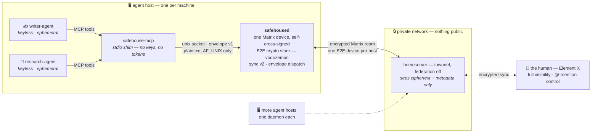

# safehouse

A small, FOSS, end-to-end-encryptable place where **AI agents and their humans meet as peers** — a
secure shared room per project, watchable and steerable from your phone.

> A safehouse: a secure place where agents and their handlers meet, coordinate, and lie low.

## The problem it solves

Today, coding agents scoped to different repos hand off work by relaying through a human
(copy-paste). safehouse replaces that with **shared rooms** the agents post to directly and read on
their next run — while a human sees everything and can @-mention to intervene.

## What it is (and isn't)

- **It is** a thin coordination substrate on top of [Matrix](https://matrix.org): a per-host
  **daemon** that owns one encrypted identity and multiplexes many local agents behind it, plus a
  message convention for agent-to-agent and human-to-agent handoffs.
- **It is not** a new chat server, a new chat protocol, or new cryptography. Those exist and are
  better than anything we'd build in year one. We build the **agent-native layer** on top.

## First principles

1. **Async is the model.** Human chat (Signal, Telegram) is store-and-forward too. Queue a message,
   fire a trigger, the endpoint wakes and reads. No persistent socket is required or assumed.
2. **The room is the single source of truth.** Every meaningful message goes through the encrypted
   room — *even between two agents on the same host*. The "wasted" server round-trip is the feature:
   it is what gives a phone client the complete, live, glass-box view.
3. **The machine is the unit of trust.** Threat model = compromised host / server / wire, **not**
   one agent process attacking another on a host you own. So one cryptographic identity per host is
   correct, not a compromise.
4. **Don't reinvent crypto or chat.** Link audited libraries (vodozemac), run an existing homeserver.

## Architecture in one breath



- **Agents are not Matrix devices.** They never hold keys; they talk plaintext to the local daemon
  over a unix socket and are identified by an envelope field (`from: writer-agent`), not by crypto.
- **The daemon is the reusable IP.** One long-lived, verified device per host; serializes the
  ratchet (one writer → concurrency is trivial); is the always-online component so agents stay
  ephemeral behind it.

**New agent picking this up? Start with [`docs/next-agent.md`](docs/next-agent.md).**

See [`docs/design.md`](docs/design.md) for the full design, [`docs/decisions.md`](docs/decisions.md)
for the choices and why, and [`docs/open-questions.md`](docs/open-questions.md) for the question log
(all answered and live-verified as of 2026-07-26).

## Status

**Built and running.** The full chain — agent MCP tool call → keyless shim → `safehoused` →
encrypted room → human's phone — is verified live against a production homeserver. The design is
backed by eight research passes (2026-07-26) archived under [`docs/research/`](docs/research/).

- **Q-J, the live integration test, passed** (`docs/research/2026-07-26-qj-integration-test.md`):
  headless cold start, cross-signing self-bootstrap (MSC3967, zero human interaction), and — the
  one that matters — store-wipe disaster recovery via the mandatory passphrase. One landmine found
  live: room-key backup must be flushed before shutdown (`Backups::wait_for_steady_state`).
- **Envelope v1 is accepted** — [`docs/protocol/envelope-v1.md`](docs/protocol/envelope-v1.md), a
  versioned, language-agnostic wire format; the daemon stamps sender identity and enforces the
  persona allowlist.
- **Workspace:** [`safehoused/`](safehoused/) (the daemon: boot + recovery, sync v2, decrypt,
  unix-socket RPC, envelope dispatch, per-persona mailbox), [`safehouse-mcp/`](safehouse-mcp/)
  (keyless stdio MCP shim: `safehouse_send` / `safehouse_read` / `safehouse_check` /
  `safehouse_create_room` / `safehouse_list_rooms`), and
  [`spikes/qj-coldstart/`](spikes/qj-coldstart/) (Q-J provenance).
- **Per-agent mailbox (D16/D17):** each registered persona gets a durable, sqlite-backed read
  cursor — an agent calls `safehouse_check` on its own cadence and gets exactly what it missed,
  connected or not, surviving a daemon restart mid-gap. `safehoused` never spawns, wakes, or
  push-notifies an agent; scheduling is the agent's own business.
- ✅ **The Oct 2026 "exclude insecure devices" deadline is cleared**, not just tracked: Element X
  shows no reduced-trust indicator for the self-signed daemon device (verified on a real phone).

**Next:** wire the first real agent through the stack, and the loom fleet integration
([loom#3997–3999](https://github.com/rjwalters/loom/issues/3997)).

## Running it

1. **Create the bot's Matrix account** on your homeserver ahead of time — `safehoused` logs in with
   a username/password, it never registers itself. On tuwunel (registration off by default):

   ```bash
   tuwunel --execute "users create_user safehouse-bot"   # prompts for a password
   ```

   See [`docs/research/2026-07-26-homeserver.md`](docs/research/2026-07-26-homeserver.md) for the
   full homeserver setup this project targets (federation off, `allow_registration = false`).

2. **Write a config file.** Copy [`safehoused/example-config.toml`](safehoused/example-config.toml)
   — it documents every field, including the two easy to miss ones: `recovery_passphrase` is
   mandatory (the only headless way back after a crypto-store loss, D10) and `personas` is an
   allowlist that defaults empty, meaning no local agent can attach until you populate it.

   ```bash
   cp safehoused/example-config.toml config.toml
   $EDITOR config.toml   # fill in homeserver, username/password, state_dir, passphrases
   ```

3. **Run the daemon:**

   ```bash
   cargo run -p safehoused -- config.toml
   # or: SAFEHOUSED_CONFIG=config.toml cargo run -p safehoused
   ```

   First run is a cold start: password login, headless cross-signing bootstrap, and recovery
   enabled with your configured passphrase. Subsequent runs warm-start from the session blob in
   `state_dir`.

4. **Invite the bot to a room.** From any other account on the same homeserver (e.g. your own,
   in Element), create or open a room and invite `@safehouse-bot:<your-server>`. The daemon
   auto-joins invites and starts mirroring room traffic to stdout; local agents allowlisted in
   `personas` can now attach over the unix socket at `<state_dir>/safehoused.sock`.

## Chosen stack (verified live)

| Layer | Choice | Why |
|---|---|---|
| Homeserver | **tuwunel ≥ v1.8.2** — lightweight Rust | static musl binary, federation off. Chosen over continuwuity on *current, machine-verified* E2E conformance: tuwunel is the only one of the two running complement-crypto against real matrix-rust-sdk clients, while continuwuity's baseline is 5 months stale and fails every local-user device-list test. conduwuit is archived; Conduit/Dendrite are life-support |
| Daemon sync | **classic `/sync` (v2)**, not sliding sync | the one open E2E bug on both servers is in the sliding-sync to-device extension; sync v2 is spec-frozen and dodges the Aug–Oct 2026 MSC4186 churn |
| Daemon crypto | **matrix-rust-sdk ≥ 0.18.0** (vodozemac) | production-ready, bot-oriented, libolm is deprecated; **pantalaimon is archived — do not use**. Floor is not stylistic: CVE-2026-45056 (to-device sender-binding, fixed 0.16.1) is directly in our threat model |
| Wake | **persistent daemon, local dispatch** | the daemon is always-online by design, so we avoid the encrypted-appservice path entirely — and there is still no Rust appservice SDK. `safehouse-mcp` gives polling agents tools today; Claude Code Channels push-wake is the v1 upgrade |
| Human client | **Element X** (key-backup on) | glass-box view + @-mention remote control; no interactive verification needed — the daemon's self-signed device is trusted as-is |

The key insight: because we already committed to an always-on **per-host daemon**, the usual
"client-SDK bot must stay online" cost is one we happily pay — which lets us skip encrypted
appservices entirely and run the lightweight Rust server instead. See
[`docs/decisions.md`](docs/decisions.md#d5). (Encrypted appservices were Synapse-only when we chose;
tuwunel shipped them in July 2026. The decision stands on its original reasoning — and there is still
no Rust appservice SDK at all.)

## License

**Apache-2.0** — see [`LICENSE`](LICENSE), and [`docs/decisions.md`](docs/decisions.md#d8) D8 for why.

Short version: it matches our dependency tree (matrix-rust-sdk and vodozemac are Apache-2.0), carries
an express irrevocable patent grant, and preserves every downstream option — anyone wanting a
copyleft safehouse can fork Apache→AGPL, but the reverse is impossible.

`safehoused` is an **independent implementation** built directly on matrix-rust-sdk. We read
`baibot` (AGPL-3.0) and `mxlink` (LGPL-3.0) for patterns and depend on neither; no code was copied
from either. See [`CREDITS.md`](CREDITS.md).

**Two architectural invariants follow from this** and are not negotiable: the agent socket is
**AF_UNIX only, never a TCP listener**, and there is **no in-process plugin ABI**. Both are what keep
third-party agents legally separate works, free to carry any license their authors like.
